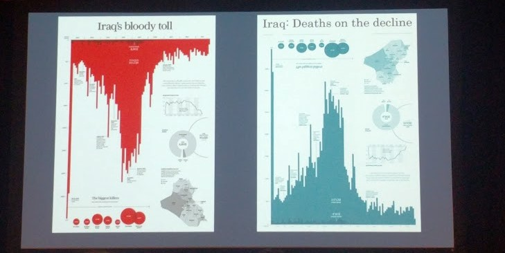

---
layout: post
title: Impact with Data (Tableau Data Day Out)
---

วันนี้ได้มีโอกาสไปร่วม Conference ที่จัดโดย Tableau ที่ Marina Bay Sands (Singapore) ในชื่อ __Tableau Data Day Out__ `#datadayout`  ซึ่งจัดได้อย่างยิ่งใหญ่ อลังการ และประทับใจมาก โดยภายในงานมี Speakers มากมาย จากหลากหลาย industry รวมไปถึงผู้เชี่ยวชาญด้านการ design dashboard โดยเฉพาะ 
บล็อกนี้จึงขอสรุปเนื้อหาสั้นๆฉบับเร่งรัด จากคุณ __Andy Cotgreave__ - Keynote speaker ในงานนี้

1. Data visualization is the means of communication
------
- การทำ data visualization ก็เหมือนกับการสื่อสารแบบนึง ซึ่งเริ่มจากการที่เราแปลง data แล้วสื่อออกไปให้กับผู้ใช้ เพราะฉะนั้นแล้ว data visualization นั้นเต็มไปด้วยความคิดเห็นของผู้สร้าง
- ตัวอย่างเช่นรูปด้านล่าง ทั้งสอง dashboard สร้างมาจาก data set เดียวกัน แต่ถูกจัดวาง เติมสี และข้อความ ทำให้ผู้อ่านรู้สึกแตกต่างกันอย่างสิ้นเชิง

2. General Design Approaches
-----------------
- การ design dashboard นั้นแบ่งออกอย่างกว้างๆ ได้ 2 แนวทาง (1) Function (2) Beauty
- หากผู้ใช้มีความจำเป็นต้องใช้ dashboard ซ้ำแล้วซ้ำเล่า เพื่อให้เกิดประสิทธิภาพสูงสุด dashboard ของคุณควรจะเน้น function เป็นหลัก
- แต่หากเป้าหมายของคุณคือการเปลี่ยนความคิดเห็น หรือโน้มน้าว จูงใจ dashboard ของคุณก็ควรจะเน้น beauty เป็นหลัก นั่นหมายถึง การ design ที่แตกต่าง นอกกรอบ ไม่เช่นนั้นผู้ใช้ก็จะเบื่อและปิดมันลง

3 Levels of Processing 
-----------------
..เดี๋ยวมาเขียนต่อ

----
* __Noted by:__ @MindMui
* __Speaker:__  Andy Cotgreave (Tableau)
