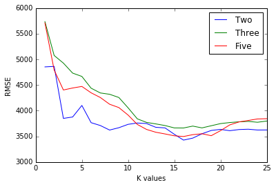

---
layout: post
title: Predict a car's market using Python
---


## Predict a car's market


For each car we have information about the technical aspects of the vehicle such as the motor's displacement, the weight of the car, the miles per gallon, how fast the car accelerates, and more. Read more about the data set [here](https://archive.ics.uci.edu/ml/datasets/automobile).


```python
import pandas as pd
import numpy as np
```

```python
cols = ['symboling', 'normalized-losses', 'make', 'fuel-type', 'aspiration', 'num-of-doors', 'body-style', 
        'drive-wheels', 'engine-location', 'wheel-base', 'length', 'width', 'height', 'curb-weight', 'engine-type', 
        'num-of-cylinders', 'engine-size', 'fuel-system', 'bore', 'stroke', 'compression-rate', 'horsepower', 'peak-rpm', 'city-mpg', 'highway-mpg', 'price']
cars = pd.read_csv('imports-85.data', names=cols)
```


```python
cars.head()
```

<div>
<table border="1" class="dataframe">
  <thead>
    <tr style="text-align: right;">
      <th></th>
      <th>symboling</th>
      <th>normalized-losses</th>
      <th>make</th>
      <th>fuel-type</th>
      <th>aspiration</th>
      <th>num-of-doors</th>
      <th>body-style</th>
      <th>drive-wheels</th>
      <th>engine-location</th>
      <th>wheel-base</th>
      <th>...</th>
      <th>engine-size</th>
      <th>fuel-system</th>
      <th>bore</th>
      <th>stroke</th>
      <th>compression-rate</th>
      <th>horsepower</th>
      <th>peak-rpm</th>
      <th>city-mpg</th>
      <th>highway-mpg</th>
      <th>price</th>
    </tr>
  </thead>
  <tbody>
    <tr>
      <th>0</th>
      <td>3</td>
      <td>?</td>
      <td>alfa-romero</td>
      <td>gas</td>
      <td>std</td>
      <td>two</td>
      <td>convertible</td>
      <td>rwd</td>
      <td>front</td>
      <td>88.6</td>
      <td>...</td>
      <td>130</td>
      <td>mpfi</td>
      <td>3.47</td>
      <td>2.68</td>
      <td>9.0</td>
      <td>111</td>
      <td>5000</td>
      <td>21</td>
      <td>27</td>
      <td>13495</td>
    </tr>
    <tr>
      <th>1</th>
      <td>3</td>
      <td>?</td>
      <td>alfa-romero</td>
      <td>gas</td>
      <td>std</td>
      <td>two</td>
      <td>convertible</td>
      <td>rwd</td>
      <td>front</td>
      <td>88.6</td>
      <td>...</td>
      <td>130</td>
      <td>mpfi</td>
      <td>3.47</td>
      <td>2.68</td>
      <td>9.0</td>
      <td>111</td>
      <td>5000</td>
      <td>21</td>
      <td>27</td>
      <td>16500</td>
    </tr>
    <tr>
      <th>2</th>
      <td>1</td>
      <td>?</td>
      <td>alfa-romero</td>
      <td>gas</td>
      <td>std</td>
      <td>two</td>
      <td>hatchback</td>
      <td>rwd</td>
      <td>front</td>
      <td>94.5</td>
      <td>...</td>
      <td>152</td>
      <td>mpfi</td>
      <td>2.68</td>
      <td>3.47</td>
      <td>9.0</td>
      <td>154</td>
      <td>5000</td>
      <td>19</td>
      <td>26</td>
      <td>16500</td>
    </tr>
    <tr>
      <th>3</th>
      <td>2</td>
      <td>164</td>
      <td>audi</td>
      <td>gas</td>
      <td>std</td>
      <td>four</td>
      <td>sedan</td>
      <td>fwd</td>
      <td>front</td>
      <td>99.8</td>
      <td>...</td>
      <td>109</td>
      <td>mpfi</td>
      <td>3.19</td>
      <td>3.40</td>
      <td>10.0</td>
      <td>102</td>
      <td>5500</td>
      <td>24</td>
      <td>30</td>
      <td>13950</td>
    </tr>
    <tr>
      <th>4</th>
      <td>2</td>
      <td>164</td>
      <td>audi</td>
      <td>gas</td>
      <td>std</td>
      <td>four</td>
      <td>sedan</td>
      <td>4wd</td>
      <td>front</td>
      <td>99.4</td>
      <td>...</td>
      <td>136</td>
      <td>mpfi</td>
      <td>3.19</td>
      <td>3.40</td>
      <td>8.0</td>
      <td>115</td>
      <td>5500</td>
      <td>18</td>
      <td>22</td>
      <td>17450</td>
    </tr>
  </tbody>
</table>
<p>5 rows × 26 columns</p>
</div>


```python
# numeric columns
continuous_values_cols = ['normalized-losses', 'wheel-base', 'length', 'width', 'height', 'curb-weight', 'bore', 'stroke', 'compression-rate', 'horsepower', 'peak-rpm', 'city-mpg', 'highway-mpg', 'price']
numeric_cars = cars[continuous_values_cols]
```

### Data Cleaning


```python
numeric_cars = numeric_cars.replace('?', np.nan)
```


```python
numeric_cars = numeric_cars.astype('float')
```


```python
# dealing with missing values
numeric_cars.isnull().sum()
```


    normalized-losses    41
    wheel-base            0
    length                0
    width                 0
    height                0
    curb-weight           0
    bore                  4
    stroke                4
    compression-rate      0
    horsepower            2
    peak-rpm              2
    city-mpg              0
    highway-mpg           0
    price                 4
    dtype: int64


```python
numeric_cars['normalized-losses'].shape
```


    (205,)


```python
# Because `price` is the column we want to predict, let's remove any rows with missing `price` values.
numeric_cars = numeric_cars.dropna(subset=['price'])
numeric_cars.isnull().sum()
```


    normalized-losses    37
    wheel-base            0
    length                0
    width                 0
    height                0
    curb-weight           0
    bore                  4
    stroke                4
    compression-rate      0
    horsepower            2
    peak-rpm              2
    city-mpg              0
    highway-mpg           0
    price                 0
    dtype: int64


```python
# Replace missing values in other columns using column means.
numeric_cars = numeric_cars.fillna(numeric_cars.mean())
```


```python
# Confirm that there's no more missing values!
numeric_cars.isnull().sum()
```


    normalized-losses    0
    wheel-base           0
    length               0
    width                0
    height               0
    curb-weight          0
    bore                 0
    stroke               0
    compression-rate     0
    horsepower           0
    peak-rpm             0
    city-mpg             0
    highway-mpg          0
    price                0
    dtype: int64


```python
# Normalize the numeric ones so all values range from 0 to 1
price_col = numeric_cars['price'] # keep price as original
numeric_cars = (numeric_cars - numeric_cars.min())/(numeric_cars.max() - numeric_cars.min())
numeric_cars['price'] = price_col
```


```python
numeric_cars.head()
```


<div>
<table border="1" class="dataframe">
  <thead>
    <tr style="text-align: right;">
      <th></th>
      <th>normalized-losses</th>
      <th>wheel-base</th>
      <th>length</th>
      <th>width</th>
      <th>height</th>
      <th>curb-weight</th>
      <th>bore</th>
      <th>stroke</th>
      <th>compression-rate</th>
      <th>horsepower</th>
      <th>peak-rpm</th>
      <th>city-mpg</th>
      <th>highway-mpg</th>
      <th>price</th>
    </tr>
  </thead>
  <tbody>
    <tr>
      <th>0</th>
      <td>0.298429</td>
      <td>0.058309</td>
      <td>0.413433</td>
      <td>0.324786</td>
      <td>0.083333</td>
      <td>0.411171</td>
      <td>0.664286</td>
      <td>0.290476</td>
      <td>0.1250</td>
      <td>0.294393</td>
      <td>0.346939</td>
      <td>0.222222</td>
      <td>0.289474</td>
      <td>13495.0</td>
    </tr>
    <tr>
      <th>1</th>
      <td>0.298429</td>
      <td>0.058309</td>
      <td>0.413433</td>
      <td>0.324786</td>
      <td>0.083333</td>
      <td>0.411171</td>
      <td>0.664286</td>
      <td>0.290476</td>
      <td>0.1250</td>
      <td>0.294393</td>
      <td>0.346939</td>
      <td>0.222222</td>
      <td>0.289474</td>
      <td>16500.0</td>
    </tr>
    <tr>
      <th>2</th>
      <td>0.298429</td>
      <td>0.230321</td>
      <td>0.449254</td>
      <td>0.444444</td>
      <td>0.383333</td>
      <td>0.517843</td>
      <td>0.100000</td>
      <td>0.666667</td>
      <td>0.1250</td>
      <td>0.495327</td>
      <td>0.346939</td>
      <td>0.166667</td>
      <td>0.263158</td>
      <td>16500.0</td>
    </tr>
    <tr>
      <th>3</th>
      <td>0.518325</td>
      <td>0.384840</td>
      <td>0.529851</td>
      <td>0.504274</td>
      <td>0.541667</td>
      <td>0.329325</td>
      <td>0.464286</td>
      <td>0.633333</td>
      <td>0.1875</td>
      <td>0.252336</td>
      <td>0.551020</td>
      <td>0.305556</td>
      <td>0.368421</td>
      <td>13950.0</td>
    </tr>
    <tr>
      <th>4</th>
      <td>0.518325</td>
      <td>0.373178</td>
      <td>0.529851</td>
      <td>0.521368</td>
      <td>0.541667</td>
      <td>0.518231</td>
      <td>0.464286</td>
      <td>0.633333</td>
      <td>0.0625</td>
      <td>0.313084</td>
      <td>0.551020</td>
      <td>0.138889</td>
      <td>0.157895</td>
      <td>17450.0</td>
    </tr>
  </tbody>
</table>
</div>


### Univariate Model


```python
from sklearn.neighbors import KNeighborsRegressor
from sklearn.metrics import mean_squared_error
```


```python
def knn_train_test(train_col, target_col, df):
    knn = KNeighborsRegressor() #instaniate
    
    # Randomize order of rows in data frame.
    np.random.seed(1)
    shuffled_index = np.random.permutation(df.index)
    rand_df = df.reindex(shuffled_index)
    
    # Divide number of rows in half and round.
    last_train_row = int(len(rand_df) / 2)
    
    # Split dataframe into train and test
    train_df = df.iloc[0:last_train_row]
    test_df = df.iloc[last_train_row:]
    
    # Fit the model, predict and calculate rmse
    knn.fit(train_df[[train_col]],train_df[target_col])
    predictions = knn.predict(test_df[[train_col]])
    rmse = mean_squared_error(predictions, test_df[target_col])**0.5
    return rmse
```


```python
# Use this function to train and test univariate models using the different numeric columns in the data set.
cols = numeric_cars.columns.drop('price')
rmse_results = {}

for col in cols:
    rmse = knn_train_test(col, 'price', numeric_cars)
    rmse_results[col] = rmse
```


```python
rmse_results_series = pd.Series(rmse_results)
rmse_results_series.sort_values()
```

horsepower            4267.730361
    highway-mpg           4628.793094
    city-mpg              4814.778015
    curb-weight           5166.828581
    width                 7110.412630
    compression-rate      8096.301512
    normalized-losses     8131.436882
    length                8304.189346
    stroke                9334.714914
    peak-rpm              9759.209970
    wheel-base            9969.243292
    height               10839.693636
    bore                 13397.091693
    dtype: float64


```python
# Modify the function to accept k as a parameter
def knn_train_test(train_col, target_col, df, k):
    knn = KNeighborsRegressor(n_neighbors=k) #instaniate
    
    # Randomize order of rows in data frame.
    np.random.seed(1)
    shuffled_index = np.random.permutation(df.index)
    rand_df = df.reindex(shuffled_index)
    
    # Divide number of rows in half and round.
    last_train_row = int(len(rand_df) / 2)
    
    # Split dataframe into train and test
    train_df = df.iloc[0:last_train_row]
    test_df = df.iloc[last_train_row:]
    
    # Fit the model, predict and calculate rmse
    knn.fit(train_df[[train_col]],train_df[target_col])
    predictions = knn.predict(test_df[[train_col]])
    rmse = mean_squared_error(predictions, test_df[target_col])**0.5
    return rmse
```


```python
rmse_results = {}
k_values = [1,3,5,7,9]

for col in cols:
    k_results = {}
    for i in k_values:
        rmse = knn_train_test(col, 'price', numeric_cars, i)
        rmse_results[col] = rmse
        k_results[i] = rmse
    rmse_results[col] = k_results
```


```python
rmse_results
```


{'bore': {1: 16502.858944335483,
      3: 13895.111787987171,
      5: 13397.091693481998,
      7: 11075.156453540423,
      9: 10178.905997122287},
     'city-mpg': {1: 5347.1502616620082,
      3: 5210.2611302222185,
      5: 4814.7780148494103,
      7: 4575.9500050566039,
      9: 4770.3441789226026},
     'compression-rate': {1: 8085.6051421555012,
      3: 8137.9697256948321,
      5: 8096.3015121133867,
      7: 7896.6928707790858,
      9: 7823.115528549677},
     'curb-weight': {1: 6566.7491754043158,
      3: 5635.1847483924475,
      5: 5166.8285806461754,
      7: 5239.6312507047951,
      9: 5244.5555635847895},
     'height': {1: 13032.276289928392,
      3: 11411.019683044135,
      5: 10839.693635873846,
      7: 10041.327943738908,
      9: 9313.3309652812659},
     'highway-mpg': {1: 5188.3334702021421,
      3: 4655.0814815167259,
      5: 4628.7930938146865,
      7: 4112.3878029567513,
      9: 4029.9622707968324},
     'horsepower': {1: 7027.6069712651306,
      3: 5400.9297932358968,
      5: 4267.7303610297877,
      7: 3821.3765663687641,
      9: 3461.132024333479},
     'length': {1: 10053.579063701594,
      3: 8230.0502485409743,
      5: 8304.1893462645621,
      7: 8483.9289137342275,
      9: 7655.12304417215},
     'normalized-losses': {1: 11628.904782718988,
      3: 9578.7932451903052,
      5: 8131.4368820724876,
      7: 7441.8142534672079,
      9: 7644.0837748147915},
     'peak-rpm': {1: 10914.812292757884,
      3: 11280.739834196191,
      5: 9759.2099697700633,
      7: 9392.8298611313967,
      9: 9423.9255454391023},
     'stroke': {1: 10925.953215320224,
      3: 11848.331671515607,
      5: 9334.714914185055,
      7: 8255.3431097911271,
      9: 7516.8591701514206},
     'wheel-base': {1: 8052.050206913359,
      3: 9171.1538785611046,
      5: 9969.2432917001752,
      7: 8938.8088091337831,
      9: 8637.3043859820991},
     'width': {1: 8044.1444455819001,
      3: 7234.5582194328254,
      5: 7110.4126300451044,
      7: 6621.8483583166962,
      9: 6531.4176381091274}}


### Multivariate Model


```python
# Modify the function to accept k as a parameter
def knn_train_test(train_col, target_col, df, k=5):
    knn = KNeighborsRegressor(n_neighbors=k) #instaniate
    
    # Randomize order of rows in data frame.
    np.random.seed(1)
    shuffled_index = np.random.permutation(df.index)
    rand_df = df.reindex(shuffled_index)
    
    # Divide number of rows in half and round.
    last_train_row = int(len(rand_df) / 2)
    
    # Split dataframe into train and test
    train_df = df.iloc[0:last_train_row]
    test_df = df.iloc[last_train_row:]
    
    # Fit the model, predict and calculate rmse
    knn.fit(train_df[train_col],train_df[target_col])
    predictions = knn.predict(test_df[train_col])
    rmse = mean_squared_error(predictions, test_df[target_col])**0.5
    return rmse
```


```python
k_rmse_results = {}

two_best_features = ['horsepower', 'width']
rmse_val = knn_train_test(two_best_features, 'price', numeric_cars, 5)
k_rmse_results["two best features"] = rmse_val

three_best_features = ['horsepower', 'width', 'curb-weight']
rmse_val = knn_train_test(three_best_features, 'price', numeric_cars, 5)
k_rmse_results["three best features"] = rmse_val

four_best_features = ['horsepower', 'width', 'curb-weight', 'city-mpg']
rmse_val = knn_train_test(four_best_features, 'price', numeric_cars, 5)
k_rmse_results["four best features"] = rmse_val

five_best_features = ['horsepower', 'width', 'curb-weight' , 'city-mpg' , 'highway-mpg']
rmse_val = knn_train_test(five_best_features, 'price', numeric_cars, 5)
k_rmse_results["five best features"] = rmse_val

six_best_features = ['horsepower', 'width', 'curb-weight' , 'city-mpg' , 'highway-mpg', 'length']
rmse_val = knn_train_test(six_best_features, 'price', numeric_cars, 5)
k_rmse_results["six best features"] = rmse_val

k_rmse_results
```


{'five best features': 4472.2804078385598,
     'four best features': 4700.6472093249722,
     'six best features': 5276.4068591201612,
     'three best features': 4667.0583479710576,
     'two best features': 4101.8359934580176}


```python
# For the top 3 models in the last step, vary the hyperparameter value from 1 to 25 and plot the resulting RMSE values.
two_best_features_results = {}
five_best_features_results = {}
three_best_features_results = {}
for k in range(1,26):
    two_best_rmse = knn_train_test(two_best_features, 'price', numeric_cars, k)
    three_best_rmse = knn_train_test(three_best_features, 'price', numeric_cars, k)
    five_best_rmse = knn_train_test(five_best_features, 'price', numeric_cars, k)
    two_best_features_results[k] = two_best_rmse
    three_best_features_results[k] = three_best_rmse
    five_best_features_results[k]  = five_best_rmse
```


```python
# Combined:
k_rmse_results = {}
k_rmse_results['Two Best Features'] = two_best_features_results
k_rmse_results['Three Best Features'] = three_best_features_results
k_rmse_results['Five Best Features'] = five_best_features_results
```


```python
import matplotlib.pyplot as plt
%matplotlib inline
```


```python
for k,v in k_rmse_results.items():
    x = list(v.keys())
    y = list(v.values())
    plt.plot(x,y)
    plt.xlabel('K values')
    plt.ylabel('RMSE')
plt.legend(['Two','Three','Five'])
plt.show()
```





### Next Steps:
- Modify the knn_train_test() function to use k-fold cross validation instead of test/train validation.
- Modify the knn_train_test() function to perform the data cleaning as well.
